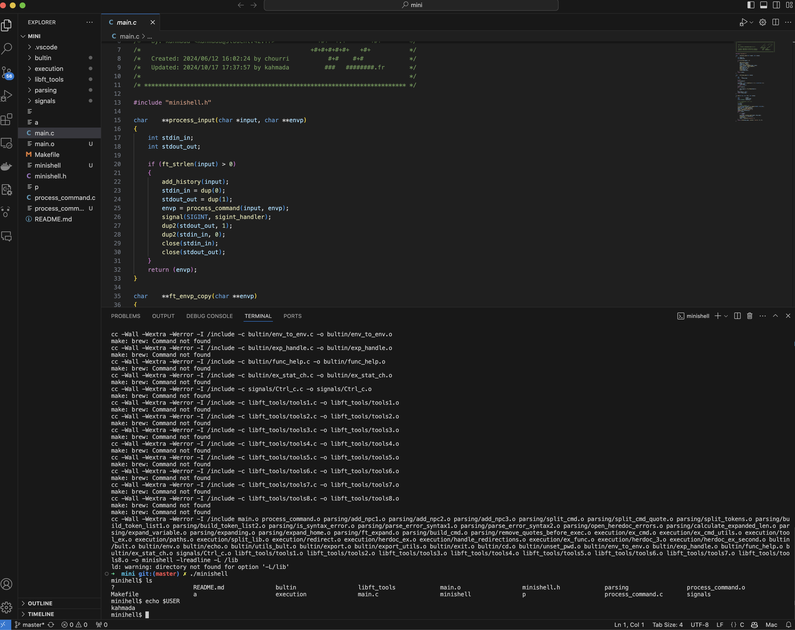

<!DOCTYPE html>
<html lang="fr">
<head>
  <meta charset="UTF-8" />
  <meta name="viewport" content="width=device-width, initial-scale=1" />
  
</head>
<body>

<section>
  <h1>minishell42</h1>

  
<strong>minishell42</strong> est un mini interpréteur de commandes Unix développé dans le cadre du projet 42. Il reproduit les fonctionnalités de base d’un shell.

  <h2>Fonctionnalités principales</h2>
  <ul>
    <li>Exécution de commandes internes (<code>cd</code>, <code>echo</code>, <code>pwd</code>, <code>export</code>, <code>unset</code>, <code>env</code>, <code>exit</code>)</li>
    <li>Exécution de commandes externes via <code>execve</code></li>
    <li>Gestion des redirections (<code>&gt;</code>, <code>&gt;&gt;</code>, <code>&lt;</code>)</li>
    <li>Gestion des pipes (<code>|</code>)</li>
    <li>Support des variables d’environnement et substitution</li>
    <li>Gestion des erreurs et des signaux (ex: <code>CTRL+C</code>)</li>
    <li>Parsing avancé avec gestion des guillemets simples et doubles</li>
  </ul>

  <h2>Installation</h2>
  <ol>
    <li>Cloner le dépôt :
      <pre><code>git clone https://github.com/kahmada/minihell.git</code></pre>
    </li>
    <li>Compiler avec <code>make</code> :
      <pre><code>cd minishell42
make</code></pre>
    </li>
    <li>Lancer le shell :
      <pre><code>./minishell</code></pre>
    </li>
  </ol>

  <h2>Utilisation</h2>
  
Une fois lancé, vous pouvez utiliser les commandes comme dans un shell classique :

  <pre><code>$ echo "Hello, minishell42!"
$ ls -l | grep minishell
$ cd ..
$ export MY_VAR=42
$ echo $MY_VAR
$ exit</code></pre>

  <h2>Structure du projet</h2>
  <ul>
    <li><code>src/</code> : code source C</li>
    <li><code>includes/</code> : fichiers header</li>
    <li><code>Makefile</code> : script de compilation</li>
    <li><code>README.html</code> : documentation du projet</li>
  </ul>

  <h2>Objectifs pédagogiques</h2>
  <ul>
    <li>Comprendre le fonctionnement d’un shell Unix</li>
    <li>Apprendre la gestion des processus et des signaux en C</li>
    <li>Maîtriser le parsing de commandes complexes</li>
    <li>Manipuler les fichiers et les flux (stdin, stdout, stderr)</li>
    <li>Gestion des erreurs et robustesse</li>
  </ul>

  <h2>kahmada &chouri</h2>
  
Projet réalisé par <strong>Ton Nom</strong> dans le cadre de la formation 42.

  <h2>Licence</h2>
  
Ce projet est open source sous licence MIT
